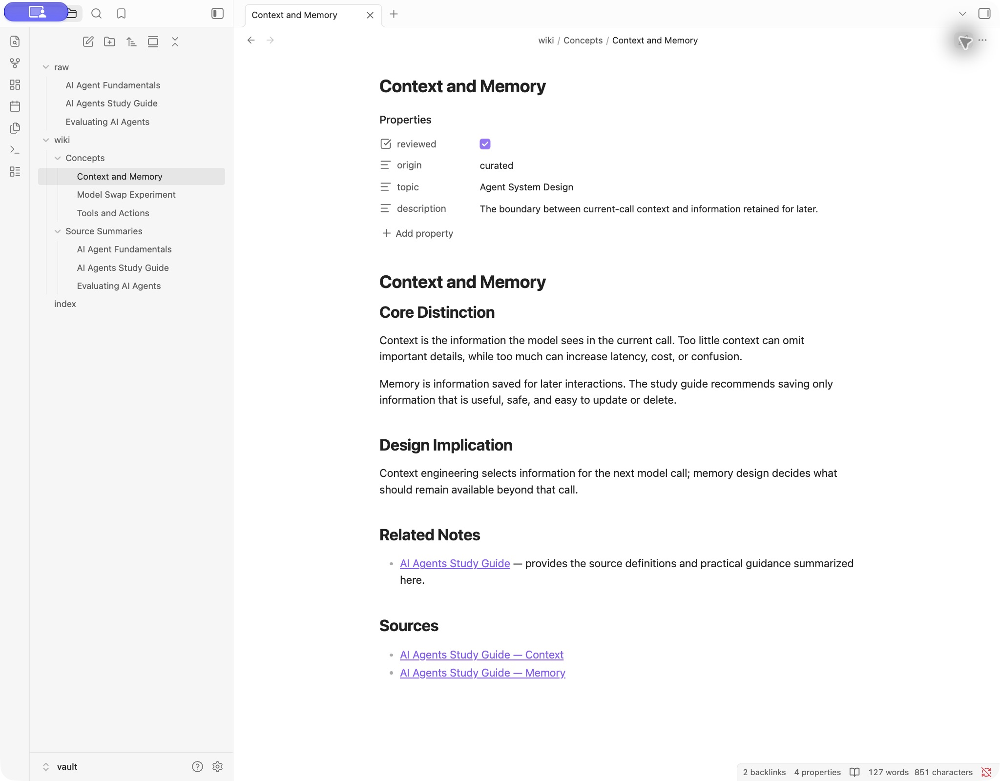
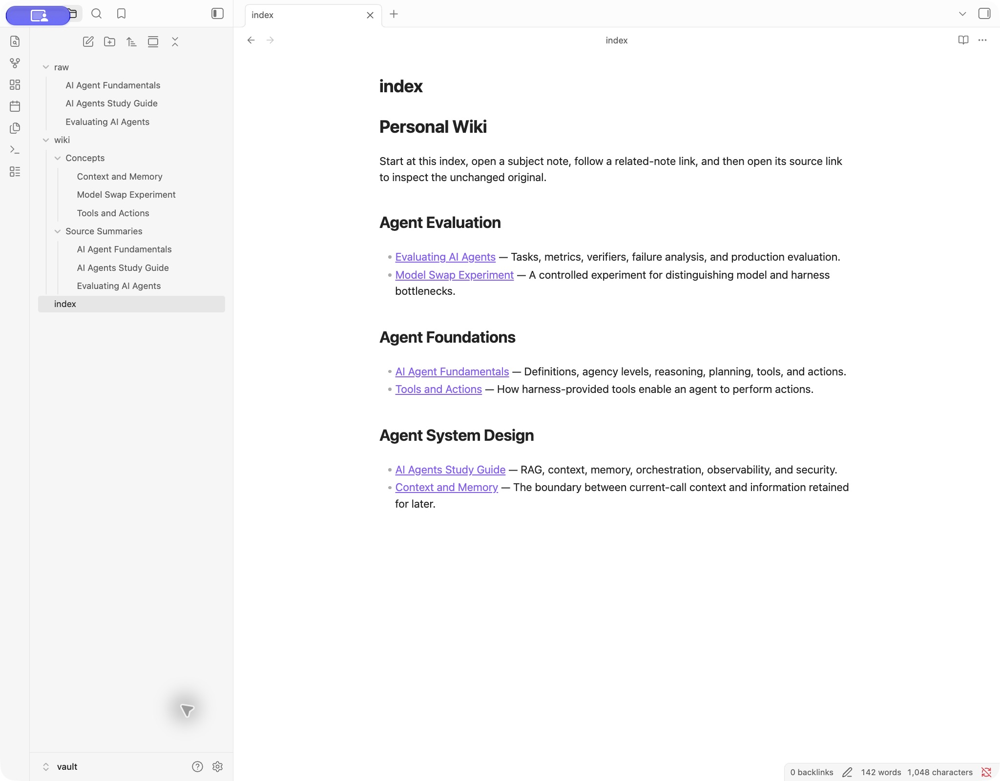
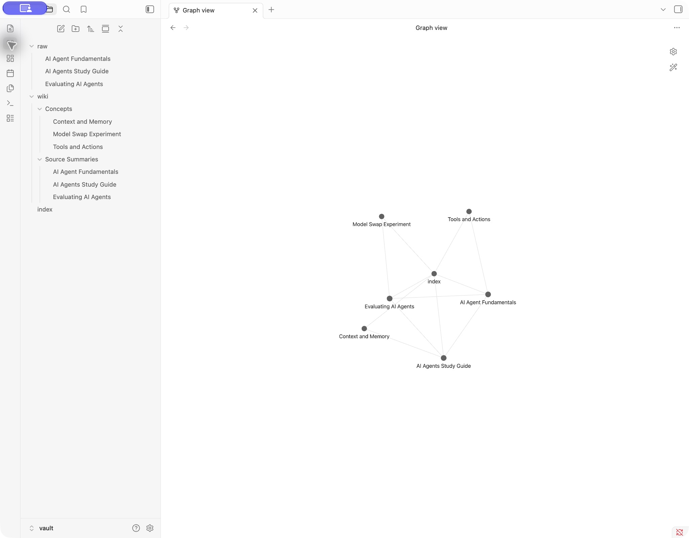
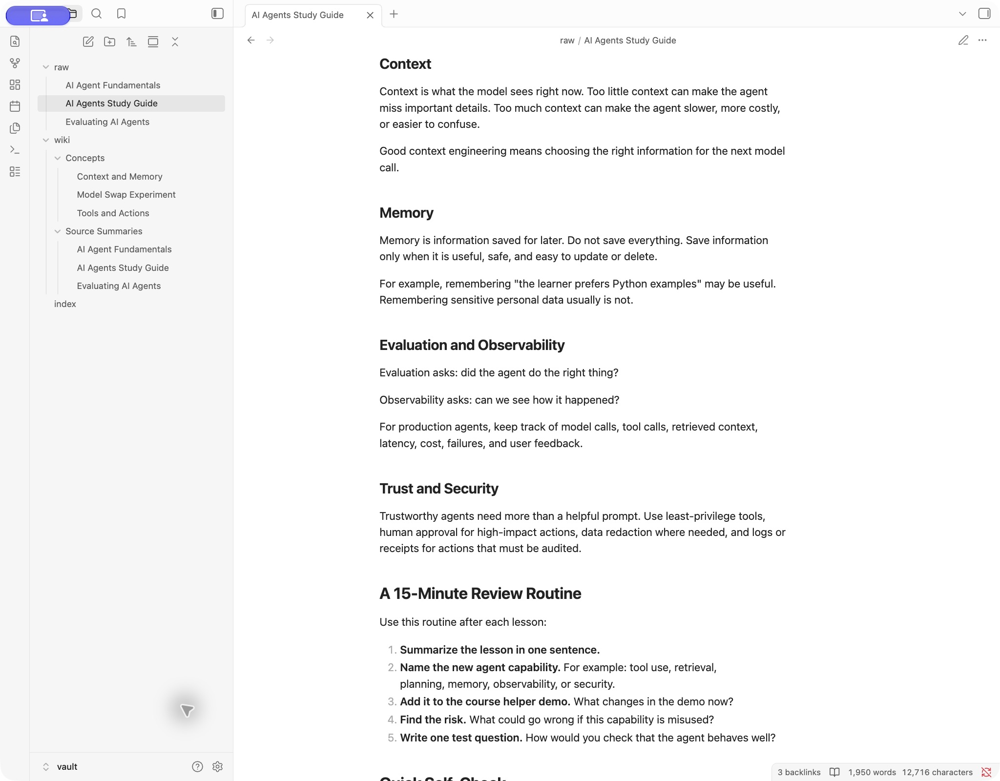
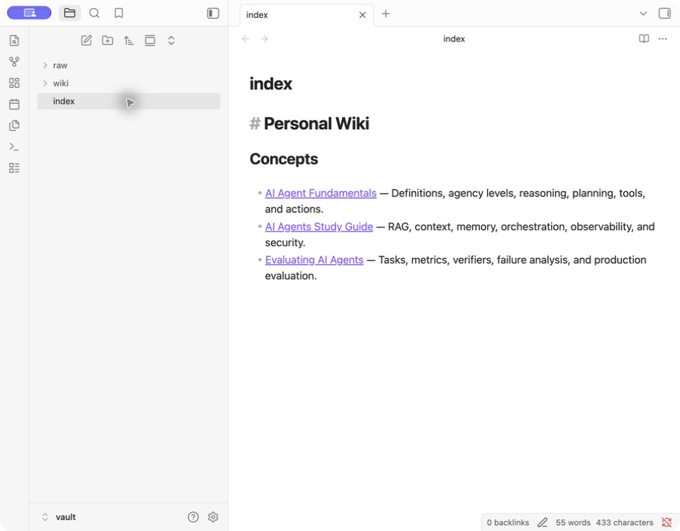
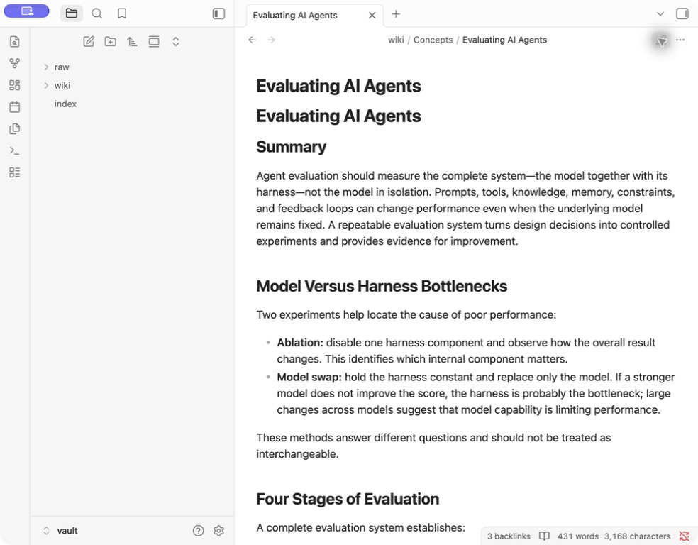
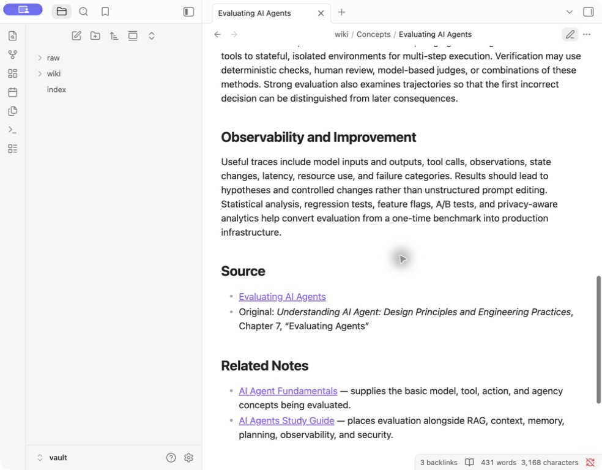
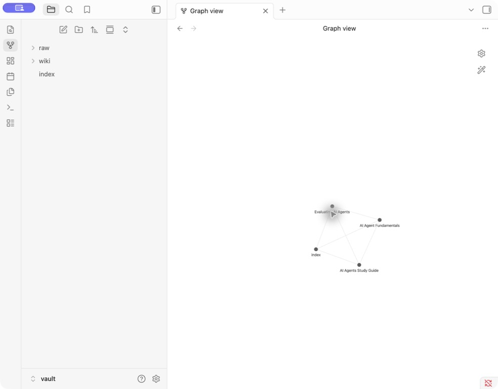

# Personal Wiki with Local Gemma and RAG

This project implements an offline command-line personal wiki for learning and researching AI-agent fundamentals. It uses a local, open-weight Gemma model through MLX-LM, a SQLite FTS5 retrieval index, explicit mode-specific prompts, source citations, and saved evidence records.

Public repository: [github.com/yukobayashi0811/personal-wiki-rag](https://github.com/yukobayashi0811/personal-wiki-rag)

## Project Status

The required CLI modes, local retrieval index, three-source wiki, fixed evaluation set, and complete network-isolated demonstration are complete. The final index contains 3 documents and 176 passages. Wiki-draft ingestion now budgets input with the actual model tokenizer and supplies all three current sources in full. All saved outputs are from actual local runs; no sample answers are presented as evaluation results. Earlier v1 and v2 evidence is retained and labeled separately.

## Required Modes

- `wiki chat`: conversational personal assistant with the last 12 turns by default, selective note retrieval, and `/notes <query>` for forced retrieval.
- `wiki ask`: standalone factual question answering from retrieved evidence, with citations or an insufficient-evidence response.
- `wiki search`: original matching passages and source locations, without answer generation.
- `wiki ingest`: unchanged source ingestion, local indexing, wiki-note generation, and index maintenance.
- `wiki --help`: command and configuration help.

## Device and Model Choice

- Device: MacBook Air with Apple M5, 10 CPU cores, 10 GPU cores, and 32 GB unified memory.
- Operating system observed during setup: macOS 27.0.
- Runtime: MLX-LM 0.31.3 on Python 3.13.
- Model: `mlx-community/gemma-4-e4b-it-4bit`.
- Model format: Apple Silicon MLX conversion, instruction-tuned, 4-bit quantization.
- Download size: approximately 5.15 GB.
- Downloaded snapshot revision: `475b9088d29754a3379866cf5aeb6b41acd313c2`.
- Memory state recorded by the current context-budget transcript (`vm_stat`, 16,384-byte pages): strict free memory was `403,703 × 16,384 = 6.61 GB`, while immediately reusable memory (`free + inactive + speculative`) was `(403,703 + 646,963 + 853) × 16,384 = 17.23 GB`.
- Disk state recorded by the same transcript: 13 GiB available on the 460 GiB data volume, with the volume at 97% capacity.

The E4B model was selected because the 32 GB device has enough unified memory for the 4-bit model plus prompt context, retrieval, and operating-system overhead. It offers more active model capacity than the smallest E2B option while avoiding the substantially larger storage and memory footprint of the 26B A4B model. E2B was not benchmarked in this project, so this is a capacity-versus-fit rationale rather than an empirical claim that E4B outperforms E2B on the fixed questions.

The initial local smoke test generated a short answer in 1.18 seconds with approximately 4.69 GB of process resident memory. See [`evidence/setup/model-smoke-test.md`](evidence/setup/model-smoke-test.md). In the current network-isolated evaluation, full-source model-backed ingestion took 134.04 seconds, with 5,400,821,760 bytes maximum resident set size, 7,419,793,656 bytes peak memory footprint, and zero swaps. Q1 took 14.09 seconds at the command level. The earlier v2 measurements remain preserved as historical comparison data.

## Architecture

The [`CLI`](src/personal_wiki/cli.py) is the user-facing command layer. The [`harness`](src/personal_wiki/harness.py) selects a mode, loads the correct instructions, controls conversation context, decides whether chat requires retrieval, calls the [`retrieval store`](src/personal_wiki/store.py), assembles prompts, invokes [`local Gemma`](src/personal_wiki/model.py), validates citation markers, handles expected errors, and saves evidence through [`evidence.py`](src/personal_wiki/evidence.py).

The retrieval tool is independent of the model. It extracts local Markdown, text, or PDF sources into passages, preserves source paths and page or section locators, and searches them with SQLite FTS5. Search mode stops after returning those original passages. Ask mode supplies retrieved passages to Gemma as non-parametric context. This is retrieval-augmented generation, not model training.

One ask-mode path is:

1. `wiki ask` parses the standalone question and displays the configured model and local execution setting.
2. The harness asks SQLite FTS5 for the top five original passages.
3. The prompt builder combines research rules, the question, passage text, filenames, section locators, and temporary `[S#]` labels.
4. MLX-LM loads the cached Gemma snapshot and generates locally.
5. The harness checks that cited markers refer to supplied passages, attempts one repair if markers are missing or invalid, and otherwise returns the insufficient-evidence response.
6. The CLI displays the answer while the evidence writer saves the input, retrieved passages, exact model, output, and timing and memory metrics.

## Repository Layout

```text
config/                 Mode-specific persona and research rules
data/                   Ignored local index and Gemma drafts; machine data stays outside the vault
evidence/               Saved runs, screenshots, and offline demonstration files
src/personal_wiki/      CLI, harness, retrieval, model, citation, and evidence code
tests/                  Deterministic unit tests
vault/raw/              Original source files, preserved unchanged
vault/wiki/Concepts/    Subject-level notes
vault/wiki/Source Summaries/  One protected summary per original source
vault/index.md          Human-readable topic index
```

## Setup

Requirements: an Apple Silicon Mac, Python 3.11 or later, sufficient local disk space for the model, and internet access only for the initial dependency and model download.

```bash
/opt/homebrew/bin/python3.13 -m venv .venv
source .venv/bin/activate
python -m pip install --upgrade pip
python -m pip install -e '.[dev]'
```

Download the exact model while online, or allow the first model-backed command to download it:

```bash
source .venv/bin/activate
hf download mlx-community/gemma-4-e4b-it-4bit
wiki status
wiki ingest ./vault/raw
```

Model weights are stored in the local Hugging Face cache and must not be committed. The default model, ask/chat generation budget, retrieval depth, bounded chat history, automatic chat-retrieval threshold, note-source budget, and note-output budget can be overridden with `WIKI_MODEL`, `WIKI_MAX_TOKENS`, `WIKI_TOP_K`, `WIKI_CHAT_TURNS`, `WIKI_CHAT_RETRIEVAL_THRESHOLD`, `WIKI_NOTE_SOURCE_MAX_TOKENS`, and `WIKI_NOTE_MAX_TOKENS`. Note budgets must be positive integers. The submitted evaluation uses a 30,000-token note-source limit and a 2,400-token note-output limit.

## Source Preparation

Place at least three shareable `.md`, `.txt`, or text-extractable `.pdf` files in `vault/raw/`. Originals are read but never rewritten. Use files that may legally and safely be included in a public repository; remove private information before ingestion.

This repository uses three open-license AI-agent sources. See [`docs/SOURCES.md`](docs/SOURCES.md) for exact provenance, revisions, licenses, checksums, and selection rationale:

- `AI Agent Fundamentals.md` — Hugging Face Agents Course;
- `AI Agents Study Guide.md` — Microsoft AI Agents for Beginners;
- `Evaluating AI Agents.md` — *Understanding AI Agent*, Chapter 7.

The selected documents cover complementary layers:

1. basic agent definitions, agency, reasoning, planning, tools, and actions;
2. system architecture, RAG, context, memory, orchestration, observability, and security;
3. evaluation design, metrics, verifiers, failure attribution, and production improvement.

## Commands

```bash
wiki --help
wiki status
wiki ingest ./vault/raw
wiki search "example topic"
wiki ask "What does the source say?" --mode local
wiki chat
```

Inside chat, use `/notes context and memory` to force a local source search.

Search works without importing or loading MLX-LM. Ask treats every question independently and does not import chat history or the chat persona. Chat retains only the last `WIKI_CHAT_TURNS` turns in the current process and never persists them across sessions.

Automatic chat retrieval follows a deterministic, model-free rule. Explicit word-boundary triggers such as “my notes,” “the wiki,” “my sources,” “according to,” and “cite” always retrieve. Otherwise, a domain knowledge question containing words such as what, how, why, explain, define, compare, or difference retrieves only when it is not a capability, conversational, drafting, or rewriting turn and its top BM25 score is at least 2.5. The domain-term vocabulary, guards, and 2.5 threshold were calibrated against the same required and adversarial sentences later used in the v2 evaluation; they are not evidence of out-of-sample generalization. The exact calibration cases and scores are disclosed in [`evidence/dev-runs-v2/README.md`](evidence/dev-runs-v2/README.md).

## Design Choices

- **Passages:** Markdown headings and PDF pages provide locators. Text is grouped toward 1,200 characters with 180 characters of overlap snapped to a word boundary. The complete sources are indexed. Wiki-note generation measures source input with the loaded model's tokenizer and applies `WIKI_NOTE_SOURCE_MAX_TOKENS`, default 30,000 tokens, at a token boundary.
- **Retrieval:** SQLite FTS5 with Porter stemming performs local BM25 ranking. Queries use important terms with OR matching, and the default top five passages retain their original filename and locator.
- **Prompts:** [`wiki-instructions.md`](config/wiki-instructions.md) restricts factual answers to retrieved evidence. [`persona.md`](config/persona.md) gives chat a recognizable but bounded assistant voice. Ask never receives the chat persona or chat history.
- **Chat context:** Conversation history exists only inside the current `wiki chat` process. The default window is the last 12 user/assistant turns and is configurable with `WIKI_CHAT_TURNS`; no chat history persists across sessions.
- **Model generation:** Ask uses temperature 0.1, chat uses 0.5, and wiki-note drafts use 0.2. Ask/chat default to 1,400 output tokens; note drafts use their independent 2,400-token default. The note limit was raised because the historical `AI Agent Fundamentals.md` draft ended mid-sentence; the post-change drafts complete all required sections.
- **Names and folders:** Original sources remain in `vault/raw/`. Subject notes use matching two-to-four-word filenames and H1 headings in `vault/wiki/Concepts/`; source-level notes live in `vault/wiki/Source Summaries/`. `vault/index.md` is generated from note frontmatter and grouped by topic. Machine chunks, IDs, and current Gemma drafts remain under ignored `data/` paths.
- **Source mapping:** Human notes link back to unchanged source filenames. Retrieval assigns `[S1]` through `[S5]` per query and records the corresponding filename, locator, text, and score in each evidence card.
- **Retrieval scope:** Retrieval intentionally indexes only the unchanged originals in `vault/raw/`, not the human wiki notes or `index.md`. This keeps answer grounding tied to primary local evidence and prevents an edited summary from being treated as a second independent source. `index.md` remains the human navigation layer.
- **Re-ingestion:** SHA-256 hashes identify unchanged sources. Unchanged files are not re-chunked or regenerated; changed sources replace indexed chunks instead of adding duplicates, removed sources are deleted from the index, every new Gemma output lands in `data/drafts/`, and protected human notes are never overwritten.

## Note Review Process

Ingestion always writes the model's verbatim note output to ignored `data/drafts/`. A missing source-summary note is created with `reviewed: false`; a generated and still-unreviewed note may be refreshed in place without creating a duplicate. A note marked `reviewed: true`, a protected legacy note, or a curated note is preserved while the new draft waits for review.

The v1 source summaries were substantially rewritten during human review, beyond the original Gemma drafts. In particular, the former 24,000-character draft budget exposed Gemma to only about 18% of the approximately 129,000-character `Evaluating AI Agents.md`, while the final v1 summary incorporated material from later sections. That defect is now corrected for the submitted corpus: the cached model configuration reports a 131,072-token context, the largest raw original is 26,763 tokens, its complete section-body payload is 26,285 tokens, and its rendered prompt is 26,503 tokens. With the 2,400-token output allowance, the total is 28,903 tokens. The measured token audit, before/after timings, and verbatim drafts are in [`evidence/context-budget/README.md`](evidence/context-budget/README.md). On 2026-09-29, the repository owner approved selectively merging the new drafts' source-backed improvements into the reviewed source summaries; the verbatim evidence remains unchanged and the reviewed notes record their `review_basis`.

## Measurement Definitions

- **Generation time** is the duration of one MLX-LM generation call after prompt assembly; it may include a lazy model load when that load occurs inside the call.
- **End-to-end ask wall time** starts before retrieval and ends after citation validation, any repair generation, evidence preparation, and answer completion.
- **RSS** is the process resident set reported by `psutil`; it does not necessarily include all unified-memory allocations used by MLX.
- **Maximum resident set size** and **peak memory footprint** are the separate macOS values reported by `/usr/bin/time -l` for the complete command.
- **MLX peak memory** is read from the MLX runtime when that API is available; otherwise the evidence records `null` rather than inventing a value.

## Running the Offline Demonstration

Prepare dependencies and the model cache while online, commit the code being demonstrated, and then run:

```bash
export HF_HUB_OFFLINE=1
export TRANSFORMERS_OFFLINE=1
export HF_HUB_DISABLE_TELEMETRY=1
./scripts/run_offline_demo_sandboxed.sh
```

The wrapper creates a clean clone of the current commit, proves DNS and direct TCP connectivity outside the sandbox, and then runs the complete suite under macOS `sandbox-exec` with `(deny network*)`. An OS sandbox is used instead of turning Wi-Fi off because it denies network operations to the CLI and its entire child-process tree across available network interfaces, while allowing the rest of the Mac to remain connected. The transcript shows the outside control probes and the corresponding failures inside the sandbox; this is process isolation, not a claim that the Wi-Fi interface was disabled.

## Evaluation

The fixed questions and pass conditions are in [`evaluation/questions.md`](evaluation/questions.md). The assessed results, metrics, mode-boundary checks, observed limitation, and proposed improvement are in [`evaluation/results.md`](evaluation/results.md).

Git history cannot prove that the fixed questions predated every first result: `evaluation/questions.md` and the first checked-in results appeared in the same commit. The repository therefore makes no stronger chronology claim. The questions remain fixed for the v2 rerun so the changed implementation can be compared with v1.

The complete requirement-to-evidence mapping is in [`docs/SUBMISSION-CHECKLIST.md`](docs/SUBMISSION-CHECKLIST.md).

Current post-change results:

- Three answerable questions passed with source citations.
- The unsupported market-revenue question returned the exact insufficient-evidence response.
- Chat followed a drafting request with “Make that shorter” while using no retrieval.
- Chat avoided retrieval for capability and drafting turns, while in-domain knowledge questions and explicit note requests retrieved and cited local sources.
- Search returned original passages and locations without loading the model.
- A personal fact introduced only in chat was not available to a separate ask command.
- Repeated ingestion detected zero changed sources and wrote zero new chunks.
- All three note sources were supplied in full; the largest generated draft includes later-source failure attribution, cost, observability, regression, and production-iteration material.

## Complete Offline Evidence

The current context-budget run is the submission run for the revised drafting code. It was invoked literally in Terminal.app and completed under the existing OS network sandbox. Its direct Terminal screenshots, transcript mapping, run cards, and output differences are indexed here:

- [Context-budget offline run index](evidence/offline-context-budget/README.md)
- [Context-budget full transcript](evidence/recordings/offline-context-budget.txt)
- [Context-budget draft review](evidence/ingest-drafts-context-budget/REVIEW.md)
- [Token audit and before/after ingest measurements](evidence/context-budget/README.md)

The following v2 material is retained as pre-context-budget history.

One macOS sandbox session denied DNS and direct TCP access to the CLI and every child process after matching probes succeeded outside. The same session completed full ingestion, repeat ingestion, all four ask tests, both required capability questions, generic drafting and follow-up, automatic and forced note retrieval, raw search, ask/chat-history separation, and changed-source re-ingestion with note protection.

The first line visible in Terminal capture 01, ending `| awk (display pacing only)`, is a display-only summary label rather than literal shell input; the actual invocation used the line-buffered wrapper plus a complete `awk` program solely to pace unchanged output and create capture-timing markers, as documented in the capture index.

- [Live Terminal rerun index and screenshot-to-transcript map](evidence/offline-terminal-rerun/README.md)
- [Live Terminal rerun transcript](evidence/recordings/offline-terminal-rerun.txt)
- [Actual unedited Terminal.app captures](evidence/offline-terminal-rerun/README.md#screenshot-to-transcript-map)
- [V2 demonstration index](evidence/offline-demo-v2/README.md)
- [V2 full command-by-command transcript](evidence/recordings/offline-full-session-v2.txt)
- [Historical v2 transcript-view captures](evidence/offline-demo-v2/README.md#screen-captures)
- [Actual v2 Gemma drafts and comparison](evidence/ingest-drafts-v2/REVIEW.md)
- [Q1: Agent anatomy](evidence/offline-demo-v2/runs/20260929T184251661935Z-ask.md)
- [Q2: Context and memory](evidence/offline-demo-v2/runs/20260929T184316710872Z-ask.md)
- [Q3: Model versus harness bottleneck](evidence/offline-demo-v2/runs/20260929T184344993439Z-ask.md)
- [Q4: Unsupported market revenue](evidence/offline-demo-v2/runs/20260929T184348907619Z-ask.md)
- [Model-swap automatic retrieval with recorded repair](evidence/offline-demo-v2/runs/20260929T184524517051Z-chat.md)
- [Search without model generation](evidence/offline-demo-v2/runs/20260929T184622818458Z-search.md)
- [V1 historical demonstration](evidence/offline-demo/README.md)

## Visual Evidence

### Current Obsidian Evidence

The captures show the reviewed vault without image editing or compositing. The note capture visibly records the repository owner's completed review as `reviewed: true`. The final graph was recaptured after removing the weak cross-topic relationships between `Model Swap Experiment` and `Context and Memory`, and between `Tools and Actions` and `Context and Memory`.









### V1 Historical Captures

The following images are the original v1 Obsidian captures and are retained as historical evidence.

### Topic Index



### Reviewed Note and Source Links





### Wiki Graph



The saved graph filter is `path:wiki OR file:index`; attachments are disabled. From `index.md`, a reader can open a concept note, follow a related-note link, and follow the source link back to the unchanged evidence in `vault/raw/`.

## Known Limitation

The current retriever uses local BM25 keyword matching. It is transparent, fast, and completely offline, but a semantically exact passage can rank behind passages with more surface-term overlap. In the v1 Q2 run, the correct definition appeared as S5 behind four noisier passages. A local embedding retriever or reranker is the next concrete improvement; it should be evaluated against the same fixed questions before replacing the current implementation.

Additional limitations are explicit:

- Wiki-note drafting is now token-limited rather than character-limited. The 30,000-token default covers every current source in full, but a future source longer than that default will be truncated at a model-token boundary and reported in `truncated_sources`. The complete prompt and requested output must remain within the selected model's context when operators raise the environment override.
- Retrieval searches only primary originals, not the subject notes or index. This strengthens grounding but means terminology introduced only during human review is not searchable by ask mode.
- Citation validation is structural: it verifies that at least one supplied `[S#]` marker is present and in range. It does not prove that every cited passage semantically entails every sentence; the fixed evaluation therefore includes a separate claim-by-claim human assessment. The current parser recognizes standalone markers such as `[S1]`, but in a grouped marker such as `[S1, S3]` it records only `S1`. This caused the v2 forced `/notes` card to omit `S3` from `cited_sources`, even though the generated answer visibly contains it.
- The v2 forced `/notes context and memory` check proves that retrieval was forced, not that the answer was good. Its top passages omitted the Study Guide definitions, the output focused on evaluation experiments instead of defining context and memory, and it changed the source phrase “Reasoning Correctness” to “Reasoning Correctiveness.” The current context-budget rerun did not repeat that typo but still failed to provide the requested definitions.
- Of the two v2 capability answers, `What can we do?` provides a concrete starting point, while `What can you help me with?` ends with the generic question “How can I help you start today?” The latter is only a partial pass for the original v2 evidence. The later Terminal rerun produced a concrete document-drafting starting point for both prompts; the difference is preserved rather than retroactively changing the v2 assessment.
- The chat retrieval rule is corpus-specific and was tuned with the evaluation sentences themselves. New sources or unseen phrasings can change BM25 score ranges and should trigger an independently held-out reevaluation.

## Safety and Submission Notes

Do not commit model weights, credentials, private documents, the local database, or unredacted private information. The public repository was checked without GitHub authentication after publication; its README, code, wiki, sources, and evidence are accessible.

## Model Sources

- [Google Gemma documentation](https://ai.google.dev/gemma/docs/core)
- [MLX-LM repository](https://github.com/ml-explore/mlx-lm)
- [MLX Gemma E4B instruction-tuned 4-bit model](https://huggingface.co/mlx-community/gemma-4-e4b-it-4bit)
